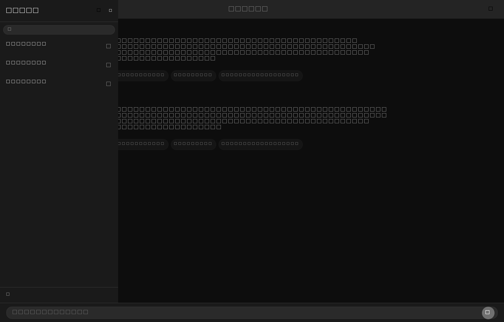
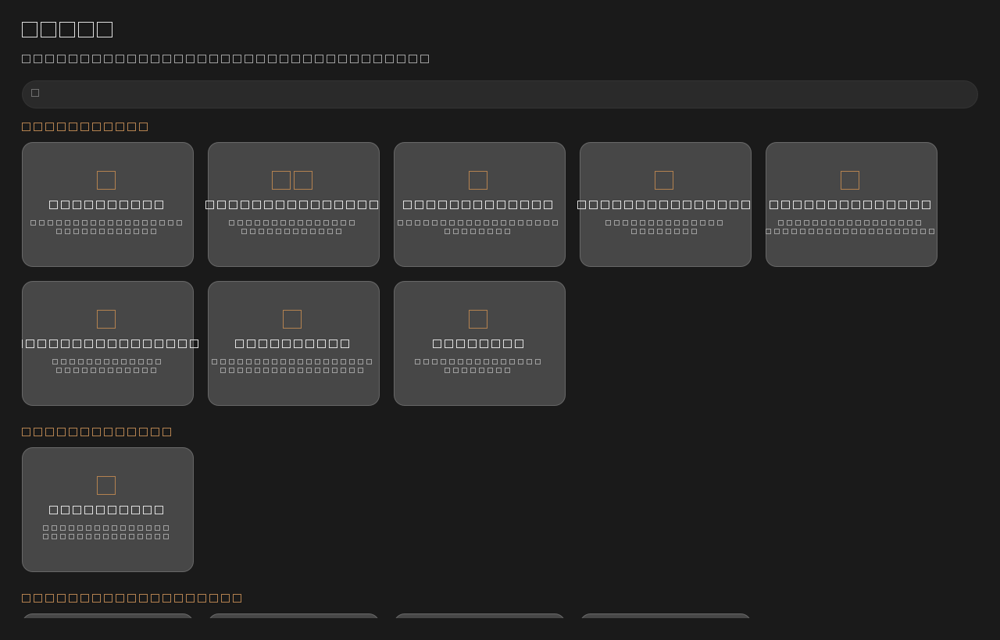

# AlBab Student Hub

> AI-powered desktop companion for university students — chat, mathematics, 3D, history, geography and study tools in one place.

**AlBab Student Hub** is a cross-platform desktop application built with **Python + Qt (PySide6 / QML)**. It combines a Gemini-powered AI chat assistant with a suite of 14 academic tools, an OpenCode CLI terminal, multi-account user profiles, dark mode and an offline-first SQLite data layer.

---

## Highlights

- **AI Chat** — Interact with Google **Gemini** (function calling: math, code, file handling, system tools) or an **OpenCode CLI** terminal provider, with persistent, pinnable chat sessions.
- **14 academic tools** — Calculator, Equation Solver, Graph Plotter, Formula Library, Linear Algebra, Graph Algorithms, Statistics, Geometry, 3D Creator, Timeline, Source Analyzer, Coordinates, Demographics and AI-powered Mind Maps.
- **AI Mind Maps** — Generate visual mind maps from any document or text using Gemini or Groq, with a smart local TF-IDF fallback when no API key is configured.
- **Profiles & authentication** — Multi-account email login with faculty context, remembered across sessions.
- **Dark / light theme** — First-class native Qt Quick UI with a polished, glassy look.
- **Keyboard-first** — `Ctrl+1–4` page switching plus new / close / export shortcuts on every page.
- **Offline-first storage** — SQLite with WAL, JSON migration path, chat history and tool state persisted locally.
- **One-file distribution** — Ship a single Windows executable via PyInstaller (`build_app.ps1`).

---

## Tech Stack

| Layer      | Technology |
| ---------- | ---------- |
| Language   | Python 3.10+ |
| UI         | PySide6 (Qt Quick / QML) |
| AI         | Google Gemini (REST/SDK), Groq (OpenAI-compatible), opencode CLI |
| Math & data| NumPy, Matplotlib, SymPy, SciPy (via backend modules) |
| 3D         | trimesh |
| Geo        | geopandas, cartopy, shapely |
| Documents  | PyPDF2 |
| Storage    | SQLite (WAL mode) |
| Build      | PyInstaller (one-file Windows EXE) |

---

## Screenshots

| AI Chat — session library (pin ⌫ delete) | Tools — 14 academic tools |
| ----------------------------------------- | ------------------------- |
|        |  |

---

## Getting Started

### Prerequisites

- **Python 3.10 or newer**
- Optional: an **OpenCode CLI** (`opencode`) installed and available on `PATH` when using the OpenCode chat provider
- A **Gemini API key** (free) from <https://aistudio.google.com/apikey> for the AI features

### Setup

```bash
# 1. Clone and enter the project
git clone https://github.com/SaadEddine-ware/AlBab-app.git
cd AlBab-app

# 2. (Recommended) Create a virtual environment
python -m venv .venv
.venv\Scripts\activate        # Windows
source .venv/bin/activate     # Linux / macOS

# 3. Install dependencies
pip install -r requirements.txt

# 4. Run the app
python main.py
```

### Run in developer mode

```bash
python main.py --dev
# or simply:
./dev.ps1
```

Developer mode stores data in a local `data-dev/` folder (isolated from your personal data), appends `[DEV]` to the window title and is ideal for hacking on the UI.

### Build a standalone Windows executable

```powershell
./build_app.ps1
```

PyInstaller produces a single **`AlBab.exe`**, copies it to your Desktop and creates an `AlBab.lnk` shortcut. Copy the EXE anywhere — it has no runtime dependencies.

---

## Configuration & API Keys

All settings are managed from the **Settings** page and stored in SQLite:

| Setting | Where | Purpose |
| ------- | ----- | ------- |
| Gemini API keys | Settings → API keys | A list of keys used with automatic **rotation** and fail-over |
| LLM provider | Settings → AI provider | `Gemini` (chat + function calling) or `OpenCode` (CLI terminal) |
| Theme | Settings → Appearance | Light or dark mode (applied live) |
| Profile | Settings → Profile | First/last name, email, faculty — shared with the AI as context |

> **Tip:** the Mind Map tool also accepts a `GROQ_API_KEY` environment variable as an alternative to Gemini.

---

## Keyboard Shortcuts

| Shortcut  | Action                      |
| --------- | --------------------------- |
| `Ctrl+1–4`| Switch between pages        |
| `Ctrl+N`  | New item in the current page (new session, new tool…) |
| `Ctrl+W`  | Close / stop current action |
| `Ctrl+E`  | Export current session      |
| `Ctrl+/`  | About dialog                |

---

## Project Structure

```
albab-app/
├── main.py                 # Application entry point, backend wiring
├── dev.ps1                 # Developer-mode launcher
├── build_app.ps1           # PyInstaller one-file Windows build
├── requirements.txt        # Python dependencies
├── core/                   # Backend logic (Python)
│   ├── database.py         # SQLite data layer (schema + migrations)
│   ├── chat_session_manager.py   # Chat sessions (create, rename, pin, delete)
│   ├── gemini_backend.py   # Gemini chat backend + function calling
│   ├── mindmap_backend.py  # AI mind maps (Gemini / Groq / local fallback)
│   ├── key_rotation.py     # Multi-key rotation & fail-over
│   ├── user_manager.py     # Multi-account authentication
│   ├── settings_manager.py # Settings service (theme, provider, profile)
│   └── …                   # Math, stats, graph, plot, mesh, geo, etc.
├── ui/                     # QML front-end (Qt Quick/Controls)
│   ├── main.qml            # Main window, page stack, shortcuts
│   ├── Sidebar.qml         # Navigation rail
│   ├── GeminiChatPage.qml  # AI chat with session panel
│   ├── OpenCodeChatPage.qml# OpenCode terminal chat
│   ├── ToolsPage.qml       # Tool grid (14 tools)
│   └── …                   # One QML component per tool/page
├── windows/                # Window/back-end adapters
├── assets/                 # Icons and branding
├── tests/                  # Python test suites
└── test_app.py             # QML smoke test (loads the full UI offscreen)
```

---

## Testing

Run the individual suites with plain Python — no extra framework required:

```bash
python test_app.py                      # QML smoke test (offscreen load + warning scan)
python tests/test_core.py               # Core backend logic
python tests/test_user_manager.py       # Auth & profiles
python tests/test_opencode.py           # OpenCode integration
python tests/test_all_features.py       # Feature-level integration
```

`test_app.py` loads the full QML application off-screen, then reports every warning emitted by the Qt engine — a fast regression net for the UI.

---

## Data & Storage

- Data lives in `~/.albab/app.db` (production) or `./data-dev/app.db` (dev mode).
- SQLite runs in **WAL mode** with foreign keys enabled.
- Legacy JSON files are migrated automatically on first run.
- Chat sessions, messages, tool histories and app state are all persisted locally and exported to Markdown via `Ctrl+E`.

---

## Roadmap ideas

- Installer wizard (existing `installer_payload`/`source_installer` groundwork)
- More language/localisation coverage
- Cloud sync of profiles and chat history

---

## License

Internal / private use. See the repository owner for licensing inquiries.